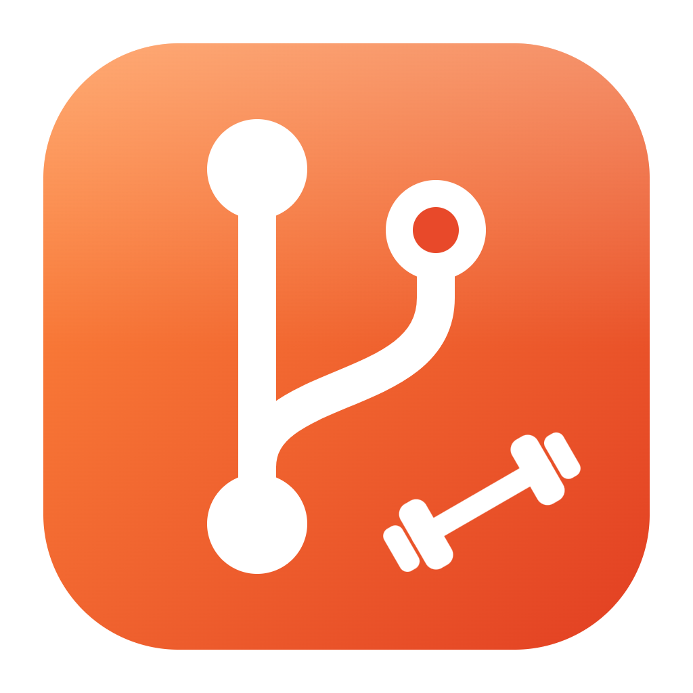

<p align="center">
  
</p>

<h1 align="center">Git Gym</h1>

<p align="center">
  コマンドで Git を動かして、体で覚える学習アプリ<br>
  SourceTree などの GUI は使ったことがあるけど、コマンドは初めて ── そんな人のための Git の練習場です。
</p>

---

## ダウンロード

[Releases ページ](https://github.com/wine-5/git-gym/releases/latest) から、自分の PC に合うファイルをダウンロードしてください。

| PC | ファイル | 使い方 |
|---|---|---|
| Windows | `GitGym-x.x.x-Windows-Setup.exe` | ダブルクリックでインストールされ、そのまま起動します |
| Windows（インストールしない） | `GitGym-x.x.x-Windows-portable.zip` | 展開して `git-gym.exe` を起動します |
| Mac（M1 / M2 / M3 など） | `GitGym-x.x.x-Mac-arm64.zip` | 展開した `Git Gym.app` をアプリケーションフォルダに入れて起動します |
| Mac（Intel） | `GitGym-x.x.x-Mac-x64.zip` | 同上 |

### 初めて起動するとき

- **Windows**：「Windows によって PC が保護されました」と出たら、「詳細情報」→「実行」を押してください。
- **Mac**：「開発元を確認できないため開けません」と出たら、アプリを **右クリック →「開く」** で開いてください（2回目からは普通に開けます）。
- **Mac で Git が入っていない場合**：アプリのホームに案内が出ます。「ターミナル」で `xcode-select --install` を実行してインストールしてください。Windows 版は Git を同梱しているので不要です。

## できること

| モード | 内容 |
|---|---|
| **練習モード** | 1ステージ＝コマンド1つ。全25ステージを星3つ目指してサクサク進める。初めての人はここから |
| **レッスン** | 全6章・29レッスン。init / add / commit からブランチ、リモート、取り消し、rebase、チーム開発の演習まで |
| **フリー練習** | 課題なしで自由にコマンドを試せる。壊してもすぐ元に戻せる |
| **コマンド辞典** | 25 のコマンドの使い方・オプション・注意点。実際に使ったコマンドには ✔ が付く |

- 練習で打つのは **本物の git コマンド** です。練習用のリポジトリは `ドキュメント/GitGym` に保存され、エクスプローラー / Finder や SourceTree でも開けます。
- コミットグラフ・「ファイルの居場所」（作業ツリー → ステージ → リポジトリ）で、コマンドの結果が目で見て分かります。
- C# / C++ / Python / JavaScript / TypeScript / Java から、練習用のコードの言語を選べます。
- 打ち間違いやよくあるエラーには日本語のヒントが出ます。

## 先生向け

- 学習の記録は「設定」→「学習の記録」→「書き出す」で CSV にできます（クリアしたレッスン・習得したコマンドの一覧。Excel で開けます）。
- 進み具合は各 PC の中だけに保存されます（サーバーは使いません）。
- 「設定」→「アプリについて」で、使っている Git のバージョンと練習用フォルダの場所が確認できます。
- 練習用の Git の設定は `ドキュメント/GitGym/.gitconfig` に分けてあるので、PC 本来の Git の設定は変わりません。

## 開発

```bash
npm install
npm run dev          # 開発用に起動
npm test             # テスト（全言語 × 全レッスン・ステージを本物の git で確かめる統合テストを含む）
npm run lint         # 型チェック
npm run fetch:git    # Windows 版に同梱する MinGit を取ってくる
npm run make         # 配布用のパッケージを作る（out/make）
npm run build:icon   # tools/icon/icon.svg からアイコンを作り直す
py -3 tools/sound/generate.py   # 効果音と BGM を作り直す
```

- `v` から始まるタグ（例: `v0.1.0`）を push すると、GitHub Actions が Windows と Mac のアプリを作って Releases に公開します。
- 画面の確認は `npx electron-forge start -- --remote-debugging-port=9334` で起動し、`scripts/ui-check.mjs` で操作・スクリーンショットを撮れます。

技術構成：Electron / React / MobX / Monaco Editor / TypeScript / webpack（Electron Forge）

## ライセンス

MIT
